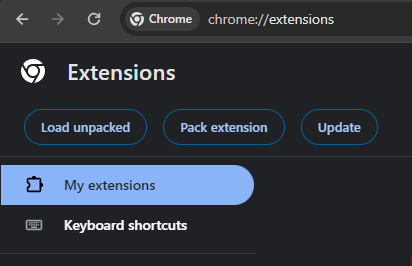
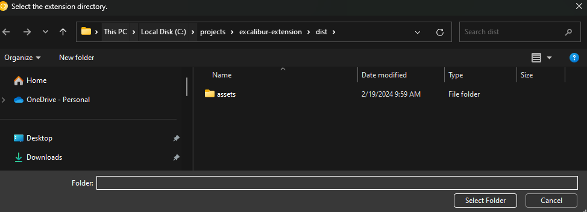
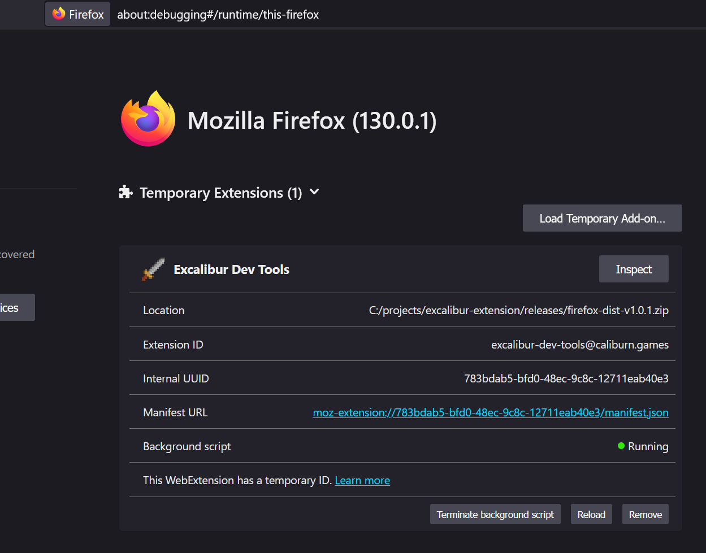

# Excalibur Dev Tools Plugin

This [excalibur game](https://excaliburjs.com) developers to easily inspect their games while making them!

Now live in browsers!

- [Install in Chrome](https://chromewebstore.google.com/detail/excalibur-dev-tools/dinddaeielhddflijbbcmpefamfffekc)
- [Install in Firefox](https://addons.mozilla.org/en-US/firefox/addon/excalibur-dev-tools/)

Debug

- Performance issues
- Actor graphics
- Actor geometry
- Colliders
- Scenes
- Toggle Debug Draw

## Chrome: Running Locally & Side Loading

If you want to develop locally

- Install node.js
- Run `npm install` in the root directory
- Run `npm run start:chrome` this will start a parcel dev server, or run `npm run build:chrome` to produce a prod bundle
- Open `chrome://extensions/` and click "Load unpacked"
  
- Select the `dist-chrome` directory in the `excalibur-extension` project
  

## Firefox: Running Locally & Side Loading

If you want to develop locally

- Install node.js
- Run `npm install` in the root directory
- Run `npm run start:firefox` this will start a parcel dev server, or run `npm run build:firefox` to produce a prod bundle
- Open `about:debugging#/runtime/this-firefox` and click "Load Temporary Add-on..."
  
- Select the manifest.json file inside the `dist-firefox` directory.

## Building a release artifact for Chrome or Firefox

- Install node.js
- Run `npm install` in the root directory
- Run `npm build:chrome` to produce the final build artifact in `dist-chrome`
  - Zip the files in the directory, not the `dist-chrome` directory
  - Upload the zip to chrome
- Run `npm build:firefox` to product the final build artifact in `dist-firefox` which can be zipped and uploaded
  - Zip the files in the directory, not the `dist-firefox` directory
  - Upload the zip to mozilla

## Features That We Want!

PR's welcome

- [ ] Global audio settings
  - [ ] List sounds that are playing
  - [ ] Mute sounds
- [ ] Excalibur Action Window Pop-up
- [x] Support firefox with manifest v3 https://extensionworkshop.com/documentation/develop/porting-a-google-chrome-extension/
- [ ] Show "no excalibur detected" if something isn't in the extension
- [ ] Make sure lite mode looks okay
- [ ] List active event listeners on stuff for debugging!
- [x] Remember debug settings across refreshes/closing
- [ ] Show entities as a tree view so child/parent relationships are clear
- [ ] Screen settings
  - [ ] Override camera with a click an drag
  - [ ] Zoom the camera!
  - [ ] Change Resolution
  - [ ] Change DisplayMode
  - [ ] Adjust antialiasing settings
  - [ ] Display Content Area
  - [ ] Expose Color Blind Testing Tools
- [x] Physics settings
  - [x] Switch between solvers Arcade/Realistic
  - [x] Max fps
  - [x] Fixed step fps
  - [x] Interpolation
  - [x] Gravity
  - [x] Iterations
- [ ] Show loaded resources
- [ ] Entity inspector side panel with component value detials

  - When you hover over an actor/entity in the game it highlights in the dev tools!

- [ ] System JS info?
  - Possible permissions https://developer.chrome.com/docs/extensions/mv3/declare_permissions/#permissions
  - Are getting GCs possible? https://developer.chrome.com/docs/extensions/reference/debugger/
  - https://github.com/MicrosoftEdge/Demos/blob/main/devtools-performance-activitytabs/index.html

## Resources

https://developer.chrome.com/docs/extensions/mv3/devtools/
