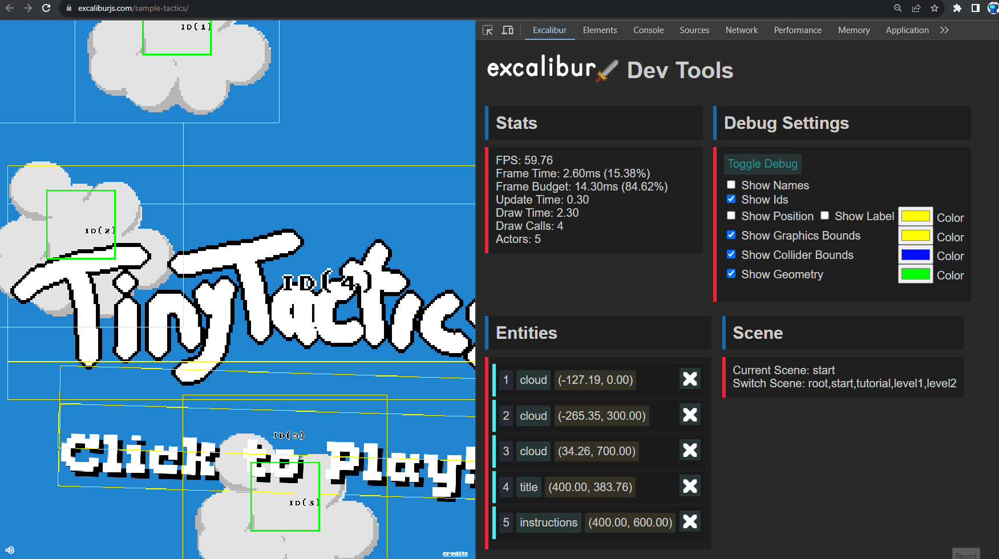

# Excalibur Dev Tools Plugin

This [excalibur game](https://excaliburjs.com) developers to easily inspect their games while making them!

Debug
* Performance issues
* Actor graphics
* Actor geometry
* Colliders
* Scenes
* Toggle Debug Draw

## Features That We Want!

PR's welcome

* [ ] Global audio settings
  * [ ] List sounds that are playing
  * [ ] Mute sounds
* [ ] Excalibur Action Window Pop-up
* [ ] Support firefox with manifest v3 https://extensionworkshop.com/documentation/develop/porting-a-google-chrome-extension/
* [ ] Show "no excalibur detected" if something isn't in the extension
* [ ] Make sure lite mode looks okay
* [ ] List active event listeners on stuff for debugging!
* [ ] Remember debug settings across refreshes/closing
* [ ] Show entities as a tree view so child/parent relationships are clear
* [ ] Screen settings
  * [ ] Override camera with a click an drag
  * [ ] Zoom the camera!
  * [ ] Change Resolution
  * [ ] Change DisplayMode
  * [ ] Adjust antialiasing settings
  * [ ] Display Content Area
  * [ ] Expose Color Blind Testing Tools
* [ ] Physics settings
  * [ ] Switch between solvers Arcade/Realistic
  * [ ] Max fps
  * [ ] Fixed step fps
  * [ ] Interpolation
  * [ ] Gravity
  * [ ] Iterations
* [ ] Show loaded resources
* [ ] Entity inspector side panel with component value detials
  - When you hover over an actor/entity in the dev tool it highlights in the game!
  - When you hover over an actor/entity in the game it highlights in the dev tools!

* [ ] System JS info?
  - Possible permissions https://developer.chrome.com/docs/extensions/mv3/declare_permissions/#permissions
  - Are getting GCs possible? https://developer.chrome.com/docs/extensions/reference/debugger/
  - https://github.com/MicrosoftEdge/Demos/blob/main/devtools-performance-activitytabs/index.html

## Resources 
https://developer.chrome.com/docs/extensions/mv3/devtools/